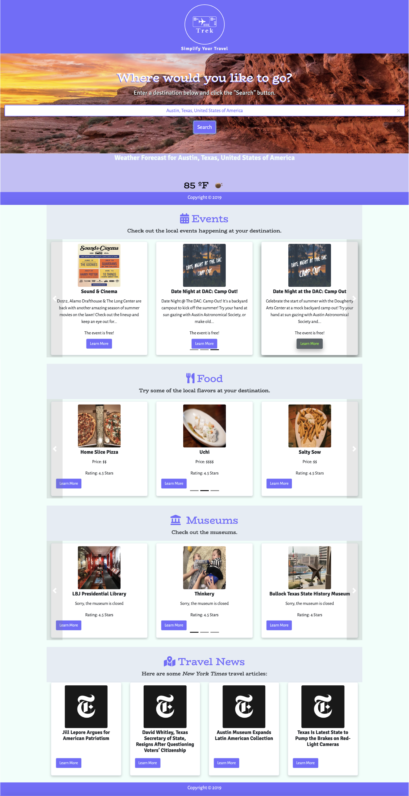

**MAY 2019 Bootcamp – Project 1**

**Trek: Simplify Your Travel – A Travel App using APIs**

## Introduction and Specifications

The project had specific technical requirements and goals. This READ ME file contains information on the Front- and Back-end specs. It also details the strategy behind the use of each technology.

General Idea—

The application that was developed is a portal that facilitates and enhances a users travel experience by allowing them to gather current weather forecasts and information on events, food/restaurants, museums, and New Times Travel News from a specific location that the user enters in the search field.

Target Audience—

Travellers (both frequent and occasional) that need quick at-the-moment information about a location. The app was built with a responsive design approach so that users can use the app no matter the media.

Primary Problem—

The problem the team identified was the need for travellers to have a central site/location to retrieve up-to-the-minute results about travel destinations both before and during their travel. In fact, users can make travel plans based on current weather and search results.

Primary Goal in User Story Format—

As a traveler, I want to have an app that works on any media I am logged into so that I have accessibility to travel information in any media format.

As a traveler, I want to be able to enter a specific city/town name into a Search field and view the search results that provide me with current travel information on the following topics: weather events, food, museums, and travel news so that I can make travel plans and decisions.

As a traveler, I want to be able to interact with the search results displayed so that I can gather additional relevant information and details about individual search results.

App Specifications

Frameworks and Technologies—

- ** GitHub** – Used for version controlFor
- ** Frameworks and Programming Languages**
  - **HTML (Bootstrap 4.3.1)** – Used for mobile responsiveness and additional components including carousel, navigation, footer
  - **CSS** – Used for styling, look and feel of the app
  - **JavaScript and jQuery** – Used for logo animation (fade) on click event, carousel action, api integration
- ** Google Fonts and Font Awesome** – Used for font families and section header iconography
- ** Coolors.com** – Used for site color scheme
- ** Wix.com** – Used for logo creation
- ** Javascript libraries**
  - Velocity js – Used for logo animation
  - Colorbox – Used with each result card display. allows for users to click a button within a card and open the search result URL within a modal
  - Moment js – Used to retrieve data based on current time. This is important functionality as we wanted to present the user with timely events, restaurants, museum events, and travel news.

API&#39;s Used—

- **OpenWeatherMap** – This api was used to provide the user with a weather forecast for the destination they entered in the search field.
- **Algolia** – This api was used to facilitate input validation; it presents the user with autocomplete options based on the characters they have already entered. For this project, we used it in the Search input field.
- **Yelp** – This api was used to retrieve data for the events, food, and museums sections in the application.
- **The New York Times Articles** – This api was used to retrieve data for the New York Times Travel Events section in the application.

Project Management

The team used a board named &quot;Trek&quot; in Trello to organize and track application development. Kanban cards were moved through the following workflow lists: _Tasks, Issues, Work In Progress, Review Pull Request, Done, Future Tasks, Issues - Completed_.

##

## Trek: Simplify Your Travel

App Minimum Viable Product

Use Case: Scenario 1

User has vacation or other time off and want to plan a trip. Depending on what events are going on, they might want to go for a weekend or a week.

Use Case: Scenario 2

Business traveller has a business trip to a city or area they are not as familiar with. They are looking for information on local events, restaurants, museums that are in the area that they can visit while there. They may even decide to extend their trip depending on what events are going on.

In both of the above scenarios, both personal and business travellers are looking for an app that will allow them to search across global destinations to plan an adventure based on an initial city search.

Using Trek

To keep the app easy to use, we offer a minimalistic landing page displaying a pleasant color scheme, logo treatment (reverse-to-white &quot;Trek&quot; logo and &quot;Simplify Your Life&quot; tagline), background image, and search field. We want the user to focus on the input field and offer help text and placeholder text within the input field.

To assist with user input of cities/towns and locations into the search field, we enlisted an api to offer the user options that can be selected. This validated the input for spelling and offered an autocomplete option that made the search input more efficient.

A user begins by either entering a city name in the text field or selecting from the autocomplete-provided options they then click the _Search_ button.

This user input and on-click _Search_ button event triggers several outcomes. The site refreshes to display the following current information for the identified destination:

- Weather forecast.
- Events listing\*
- Food/restaurants listing\*
- Museums listing\*
- The New York Times Travel articles listing\*

\*_Listings for each section are presented as &quot;cards&quot; within a carousel_.

Users have several options at this point. Using the carousel functionality, they can quickly scroll through the search results. If there is a particular one that interests them, a user can click the &quot;Learn More&quot; button. Clicking this button will do one of two things: open a modal with the site inside--user can close the modal as normal or it opens a new page with the selected site.

The modal option is preferred as it allows the user to remain within the Trek application.

Users can always return to the Search area and enter a new destination.

## Appendix

Future iterations of this application will include the following enhancements:

- The ability for users to hit the Enter key to trigger the search event
- Add a Flight Scanner section that allows users to book flights
- Integrate a ride share app(s) to facilitate users get to their destination
- Enhance the weather forecast information so that the user sees a 7-day forecast instead of the current temperature and conditions
- Allow users to select and save cards as &quot;Favorites&quot;
- Integrate &quot;Favorited&quot; event to users calendar
- Additional sections [to be determined]

Team 8 members: Phillip Valdez, Jaime Rodriguez, Manuel Velasquez, Juan Baquera